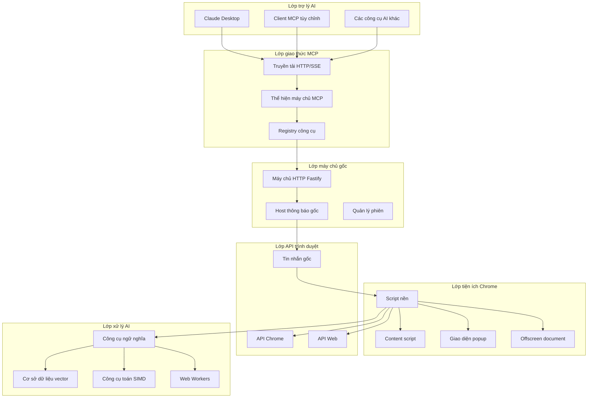

# Thiết kế kiến trúc Chrome MCP Server 🏗️

Tài liệu này cung cấp tổng quan kỹ thuật chi tiết về kiến trúc, quyết định thiết kế và chi tiết triển khai của Chrome MCP Server.

## 📋 Mục lục

- [Tổng quan](#tổng-quan)
- [Kiến trúc hệ thống](#kiến-trúc-hệ-thống)
- [Chi tiết thành phần](#chi-tiết-thành-phần)
- [Luồng dữ liệu](#luồng-dữ-liệu)
- [Tích hợp AI](#tích-hợp-ai)
- [Tối ưu hóa hiệu năng](#tối-ưu-hóa-hiệu-năng)
- [Cân nhắc bảo mật](#cân-nhắc-bảo-mật)

## 🎯 Tổng quan

Chrome MCP Server là một nền tảng tự động hóa trình duyệt phức tạp, kết nối các trợ lý AI với chức năng của trình duyệt Chrome thông qua Model Context Protocol (MCP). Mục tiêu thiết kế kiến trúc:

- **Hiệu năng cao**: Các thao tác AI được tối ưu hóa SIMD và truyền thông báo gốc hiệu quả
- **Khả năng mở rộng**: Hệ thống công cụ mô-đun, dễ dàng thêm chức năng mới
- **Độ tin cậy**: Xử lý lỗi mạnh mẽ và giảm cấp linh hoạt
- **Bảo mật**: Thực thi trong sandbox và kiểm soát truy cập dựa trên quyền

## 🏗️ Kiến trúc hệ thống



## 🔧 Chi tiết thành phần

### 1. Máy chủ gốc (`app/native-server/`)

**Mục đích**: Triển khai giao thức MCP và cầu nối tin nhắn gốc

**Các thành phần cốt lõi**:

- **Máy chủ HTTP Fastify**: Xử lý giao thức MCP dựa trên HTTP/SSE
- **Host tin nhắn gốc**: Giao tiếp với tiện ích Chrome
- **Quản lý phiên**: Quản lý nhiều phiên client MCP
- **Registry công cụ**: Định tuyến các lệnh gọi công cụ đến tiện ích Chrome

**Ngăn xếp công nghệ**:

- TypeScript + Fastify
- MCP SDK (@modelcontextprotocol/sdk)
- Giao thức tin nhắn gốc

### 2. Tiện ích Chrome (`app/chrome-extension/`)

**Mục đích**: Tự động hóa trình duyệt và phân tích nội dung được hỗ trợ bởi AI

**Các thành phần cốt lõi**:

- **Script nền**: Bộ điều phối chính và trình thực thi công cụ
- **Content script**: Tương tác trang và trích xuất nội dung
- **Giao diện popup**: Cấu hình người dùng và hiển thị trạng thái
- **Offscreen document**: Xử lý mô hình AI trong môi trường cô lập

**Ngăn xếp công nghệ**:

- WXT framework + Vue 3
- API tiện ích Chrome
- WebAssembly + SIMD
- Transformers.js

### 3. Các package chia sẻ (`packages/`)

#### 3.1 Kiểu chia sẻ (`packages/shared/`)

- Schema và định nghĩa kiểu cho công cụ
- Giao diện và tiện ích chung
- Kiểu giao thức MCP

#### 3.2 WASM SIMD (`packages/wasm-simd/`)

- Các hàm toán học được tối ưu hóa SIMD dựa trên Rust
- Biên dịch sang WebAssembly bằng Emscripten
- Tăng tốc tính toán vector 4-8 lần

## 🔄 Luồng dữ liệu

### Luồng thực thi công cụ

```
┌─────────────┐    ┌──────────────┐    ┌─────────────────┐    ┌──────────────┐
│ Trợ lý AI   │    │ Máy chủ gốc  │    │ Tiện ích Chrome │    │ API trình duyệt│
└─────┬───────┘    └──────┬───────┘    └─────────┬───────┘    └──────┬───────┘
      │                   │                      │                   │
      │ 1. Gọi công cụ    │                      │                   │
      ├──────────────────►│                      │                   │
      │                   │ 2. Tin nhắn gốc      │                   │
      │                   ├─────────────────────►│                   │
      │                   │                      │ 3. Thực thi công cụ│
      │                   │                      ├──────────────────►│
      │                   │                      │ 4. Phản hồi API   │
      │                   │                      │◄──────────────────┤
      │                   │ 5. Kết quả công cụ   │                   │
      │                   │◄─────────────────────┤                   │
      │ 6. Phản hồi MCP   │                      │                   │
      │◄──────────────────┤                      │                   │
```

### Luồng xử lý AI

```
┌─────────────┐    ┌──────────────┐    ┌─────────────────┐    ┌──────────────┐
│ Trích xuất   │    │ Bộ phân đoạn │    │ Công cụ ngữ     │    │ Cơ sở dữ     │
│ nội dung    │    │ văn bản      │    │ nghĩa           │    │ liệu vector  │
└─────┬───────┘    └──────┬───────┘    └─────────┬───────┘    └──────┬───────┘
      │                   │                      │                   │
      │ 1. Nội dung thô   │                      │                   │
      ├──────────────────►│                      │                   │
      │                   │ 2. Đoạn văn bản      │                   │
      │                   ├─────────────────────►│                   │
      │                   │                      │ 3. Vector nhúng  │
      │                   │                      ├──────────────────►│
      │                   │                      │                   │
      │                   │ 4. Truy vấn tìm kiếm │                   │
      │                   ├─────────────────────►│                   │
      │                   │                      │ 5. Vector truy vấn│
      │                   │                      ├──────────────────►│
      │                   │                      │ 6. Tài liệu tương tự│
      │                   │                      │◄──────────────────┤
      │                   │ 7. Kết quả tìm kiếm  │                   │
      │                   │◄─────────────────────┤                   │
```

## 🧠 Tích hợp AI

### Công cụ tương tự ngữ nghĩa

**Kiến trúc**:

- **Hỗ trợ mô hình**: BGE-small-en-v1.5, E5-small-v2, Universal Sentence Encoder
- **Môi trường thực thi**: Web Workers để xử lý không chặn
- **Tối ưu hóa**: Tăng tốc SIMD cho các phép toán vector
- **Bộ nhớ đệm**: Bộ nhớ đệm LRU cho embedding và tokenization

**Tối ưu hóa hiệu năng**:

```typescript
// Tương tự cosin được tăng tốc bằng SIMD
const similarity = await simdMath.cosineSimilarity(vecA, vecB);

// Xử lý hàng loạt để tăng hiệu quả
const similarities = await simdMath.batchSimilarity(vectors, query, dimension);

// Phép toán ma trận tiết kiệm bộ nhớ
const matrix = await simdMath.similarityMatrix(vectorsA, vectorsB, dimension);
```

### Cơ sở dữ liệu vector (hnswlib-wasm)

**Tính năng**:

- **Thuật toán**: Hierarchical Navigable Small World (HNSW)
- **Triển khai**: Triển khai WebAssembly đạt hiệu năng gần native
- **Lưu trữ**: Lưu trữ IndexedDB, tự động dọn dẹp
- **Khả năng mở rộng**: Xử lý hiệu quả 10,000+ tài liệu

**Cấu hình**:

```typescript
const config: VectorDatabaseConfig = {
  dimension: 384, // Chiều embedding của mô hình
  maxElements: 10000, // Số tài liệu tối đa
  efConstruction: 200, // Độ chính xác khi xây dựng
  M: 16, // Tham số kết nối
  efSearch: 100, // Độ chính xác khi tìm kiếm
  enableAutoCleanup: true, // Tự động dọn dẹp dữ liệu cũ
  maxRetentionDays: 30, // Thời gian lưu giữ dữ liệu
};
```

## ⚡ Tối ưu hóa hiệu năng

### 1. Tăng tốc SIMD

**Triển khai Rust**:

```rust
use wide::f32x4;

fn cosine_similarity_simd(&self, vec_a: &[f32], vec_b: &[f32]) -> f32 {
    let len = vec_a.len();
    let simd_lanes = 4;
    let simd_len = len - (len % simd_lanes);

    let mut dot_sum_simd = f32x4::ZERO;
    let mut norm_a_sum_simd = f32x4::ZERO;
    let mut norm_b_sum_simd = f32x4::ZERO;

    for i in (0..simd_len).step_by(simd_lanes) {
        let a_chunk = f32x4::new(vec_a[i..i+4].try_into().unwrap());
        let b_chunk = f32x4::new(vec_b[i..i+4].try_into().unwrap());

        dot_sum_simd = a_chunk.mul_add(b_chunk, dot_sum_simd);
        norm_a_sum_simd = a_chunk.mul_add(a_chunk, norm_a_sum_simd);
        norm_b_sum_simd = b_chunk.mul_add(b_chunk, norm_b_sum_simd);
    }

    // Tính toán độ tương tự cuối cùng
    let dot_product = dot_sum_simd.reduce_add();
    let norm_a = norm_a_sum_simd.reduce_add().sqrt();
    let norm_b = norm_b_sum_simd.reduce_add().sqrt();

    dot_product / (norm_a * norm_b)
}
```

### 2. Quản lý bộ nhớ

**Chiến lược**:

- **Object pool**: Tái sử dụng các bộ đệm Float32Array
- **Lazy loading**: Tải mô hình AI theo yêu cầu
- **Quản lý bộ nhớ đệm**: Loại bỏ LRU cho embedding
- **Garbage collection**: Dọn dẹp tường minh các đối tượng lớn

### 3. Xử lý đồng thời

**Web Workers**:

- **Xử lý AI**: Worker riêng cho suy luận mô hình
- **Lập chỉ mục nội dung**: Lập chỉ mục nội dung thẻ nền
- **Bắt gói mạng**: Xử lý yêu cầu song song

## 🔧 Điểm mở rộng

### Thêm công cụ mới

1. **Định nghĩa schema** trong `packages/shared/src/tools.ts`
2. **Triển khai công cụ** kế thừa `BaseBrowserToolExecutor`
3. **Đăng ký công cụ** trong chỉ mục công cụ
4. **Thêm kiểm thử** cho kiểm thử chức năng

### Mô hình AI tùy chỉnh

1. **Tích hợp mô hình** trong `SemanticSimilarityEngine`
2. **Hỗ trợ Worker** để xử lý
3. **Cấu hình** trong preset mô hình
4. **Kiểm thử hiệu năng** sử dụng benchmark

### Mở rộng giao thức

1. **Mở rộng MCP** cho chức năng tùy chỉnh
2. **Lớp truyền tải** cho các phương thức giao tiếp khác nhau
3. **Xác thực** cho kết nối bảo mật
4. **Giám sát** cho các chỉ số hiệu năng

Kiến trúc này cho phép Chrome MCP Server cung cấp khả năng tự động hóa trình duyệt hiệu năng cao và các tính năng AI tiên tiến trong khi vẫn duy trì tính bảo mật và khả năng mở rộng.
